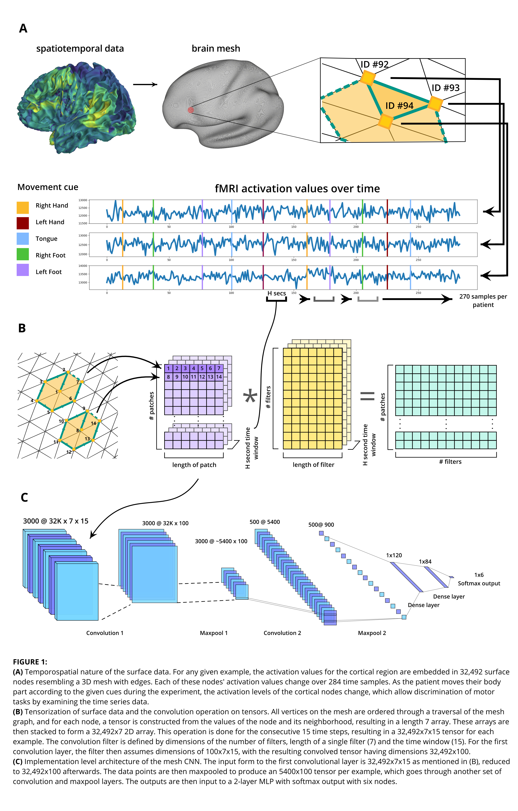
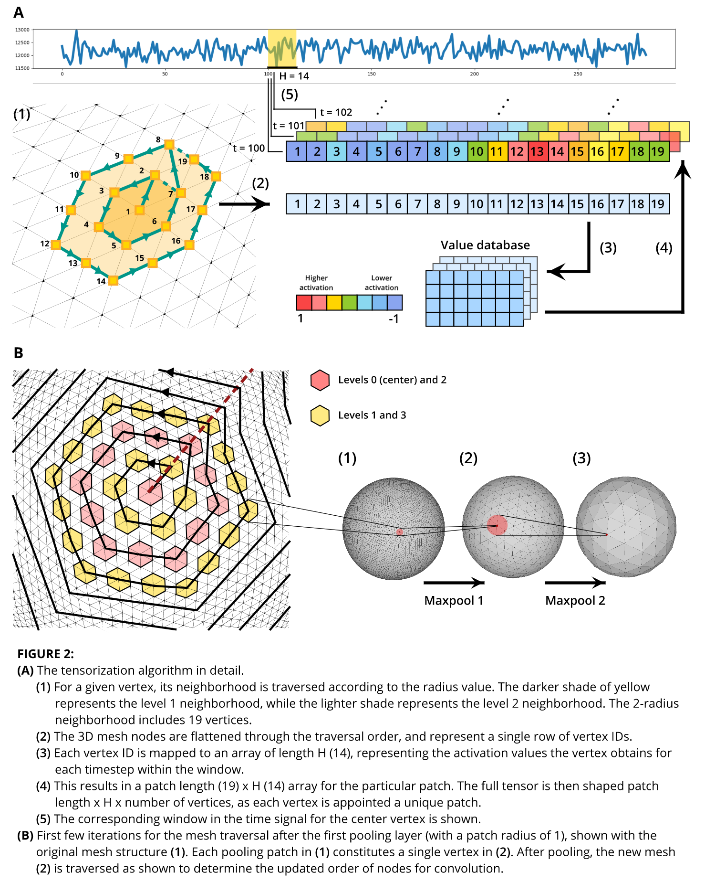

Convolutional Neural Network Applications on Surface-Based Temporospatial Neuroimaging Data
===========================================================================================

Semih Cantürk1, Cassiano Becker1, Edward Benjamin Fineran2 and Victor M. Preciado1

**1** University of Pennsylvania, Department of Electrical and Systems Engineering (Philadelphia, PA, United States); **2** University of Pennsylvania, Department of Computer and Information Science (Philadelphia, PA, United States)

## 1. Abstract

## 2. Introduction

Convolutional neural networks (Krizhevsky et al. 2012; LeCun & Bengio 1998) have been the leading method in solving pattern recognition problems in the recent years. CNNs use of shared filters render them location invariant, meaning they can detect and recognize local feature regardless of their positions in the visual field. The conventional CNN approaches are also translatable into three dimensions (3D) in cases where the detection of spatial and/or temporal relations in the third dimension is trivial; such is the case with pattern detection in dynamic images and 3D volume. However, a trivial translation is not possible in dynamic 3D polygon meshes, where the problem at hand involves irregular polygonal surface structures in 3D space as well as temporal relations over the 3D space.

In neuroimaging, a common and interpretable way of visualizing cerebral activity is through the mapping of functionality data to the brain morphometry domain. This mapping is usually done in three dimensions (3D) by modeling the 3D geometry of the cortical surface through polygon meshes and projecting the activations on the model. The 3D surface representations has been used to visualize cortical thickness (Fischl & Dale 2000), electroencephalography (EEG) (Heinonen et al. 1999) and functional magnetic resonance imaging (fMRI) (Chen & Li 2012). However, most of these brain functionality visualizations serve solely as interpretability tools for medical professionals, and are not used in mathematical and statistical analysis of the brain functionality. As a result, the applications of machine learning methods, and particularly of CNNs which can make use of the visualized spatiotemporal relations, on 3D mesh representations of brain activity are limited in number of scope. While methods to apply CNNs to cortical meshes have recently been proposed, the applications have been on toy discriminatory tasks. For example, (Seong et al. 1999) have used CNNs for sex discrimination based on cortical surface representations.

This article proposes a form of CNN that is adapted to pattern recognition in spatiotemporal 3D triangular mesh data, referred as the mesh CNN (mCNN); it also examines in depth the translation of spatiotemporal fMRI data from 3D cortical visualization into regular data structures that a multi-layer mCNN is able to make use of, while simultaneously preserving the spatiotemporal relations essential for the discriminative ability of the model. The cortical mesh is first treated as an icosahedral sphere, to which it is analogous in terms of both topology and triangular mesh structure. The mCNN is then designed to traverse and preprocess the mesh, and apply subsequent convolutions and pooling in order to detect detect patterns both in 3D space and in time. This mCNN is then applied on a motor task classification problem derived from the Human Connectome Project (HCP; Elam & Van Essen 2013). The mCNN is then compared in classification accuracy to a two-layer MLP, which had been used in previous work for the same discriminatory task.

## 3. Method

### 3.1. Mesh CNN 

In high-level architecture, the mCNN is analogous to conventional CNNs: it is composed of repeating convolutional and pooling layers, followed by full layers with a softmax output layer. However, the main differentiators of the mCNN from the conventional CNN are the low-level implementations of the convolutional layers and the mesh pooling layers. While the traditional convolution and pooling layers deal with 2D data in multidimensional array form which are then trivially treated as tensors, the mCNN convolution and pooling layers involve low level architectural adaptations to 3D mesh data in time series form in order to build the tensors.

#### 3.1.1. Convolution Layer 

In conventional CNNs, the convolution filters are defined by regular shapes; a square is often used due to its trivial translatability to 2D array data structures. These filters are then convolved samples from the data which are congruent, which are called “patches". This sampling operation is referred to as “striding”, where patches from data are called iteratively in a predefined order.

The mCNN defines this convolution operation as a _vertex domain mesh convolution_. The convolutions associate each data point with a patch, defined by all vertices within a specific graph distance from the point, ordered by a) graph distance from the center vertex which contains the associated data value, and b)the following ordering for vertices of the same graph distance/order:

1.  The vertex with the closest euclidean distance in 3D, vertex A, is queued first.
2.  At this point, the verticess of the same order will form a circle, with each vertex having two neighbors of the same order. Then, of its two neighbors, the one with the closest euclidean distance to vertex A is queued, determining whether the order is clockwise or counterclockwise.
3.  From then on, the order is trivial. In the direction defined in 2), all unvisited vertices are visited in order.
4.  The list of all unseen neighbors of the vertices from the current layer is delegated as the next layer.

Then, to account for the time dimension, a time window H is selected **(Figures 1, 2A)**: The convolution tensor for one example contains the patches from all vertices, for all time samples within the time window H. Multiple examples (270 for our motor task classification experiment) are generated from a single patient by slicing running windows of width H through the patient data, which include 284 consecutive time samples **(Figure 1A)**. The convolution tensors are constructed by flattening the patch dimension for each vertex n to form a row vector. This results in a (l \\times N \\times H) tensor, where l is the length of a single patch and Nis the total number of vertices in the mesh. A single HCP patient data then produces 270 of these tensors. Each filter then also assumes the (l \\times H) shape, with the convolutional layer possessing f number of filters. The convolution operation then, dimensionally speaking, takes place as the following:

(l \\times N \\times H) \* (f \\times l \\times H) = (f \\times N)

**Figure 1A** demonstrates the spatiotemporal nature of the data: Each vertex has a position in 3D space and is connected to neighbor vertices via edges, and also contains a vector of 284 consecutive fMRI activation values that change over time. It also includes information about the HCP experiment procedure; the activation over time plot shows when the cues are given to the subjects, and which body part was moved with each cue**.** **Figure 1A** is then connected to **Figure 1B** by showing how a H second window is translated into a tensor dimension. **1B** also visualizes the tensor operations in the convolution layer, while **Figure 2A** illustrates the implementation of this tensorization process in detail. **Figure 1C t**hen displays the high-level architecture of the mCNN, which is very similar to that of a conventional CNN.

#### 3.1.2. Pooling Layer

In the mCNN, the convolution layers are followed by the pooling layers which downsample the outputs of the convolution process. This is done in order to reduce the dimensionality of the data, curbing potential overfitting and reducing the computational cost of the mCNN. The mCNN pooling process is centered around the triangular structure of the surface mesh. **Figures 1A** and **2A** provide close-ups of the mesh structure: each vertex is connected to six other vertices, forming six triangle faces. When pooling, each vertex is assigned to a vertex “group” of seven vertices, with center points being equidistant in terms of graph distance so that the groups do not overlap and pooling is homogeneous. This pooling of seven vertices into one reduce the number of vertices in the mesh by a factor of six per pooling layer. The original surface mesh is composed of 32,492 vertices; this number reduces to approximately 5400 after the first convolution and pooling, and to 900 after the second, excluding a small number of vertices associated with irregularities in the mesh. **Figure 2B** demonstrates this pooling process both in vertex-level and mesh-level. In the study, we tested both max pooling and mean pooling approaches, and found mean pooling to perform slightly better on average.

### 3.2. Implementation

The mCNN implementation was based on the HIPS Convnet, which in turn is a CNN built for MNIST modeled on the LeNet-5 (LeCun et al. 1998, p. ). The current architecture consists of two convolution and pooling layer pairs, followed by two dense layers and a softmax output - the architecture is shown in detail **Figure 1C**. As mentioned in Section 3.1.2, mean pooling was preferred over max pooling in the pooling layers. The network uses conventional backpropagation and batch gradient descent. It is important to note that this architecture is currently suboptimal, and several architectural changes are proposed and investigated to improve mCNN performance. This section will be updated with the appropriate changes once implemented. The proposed changes are as follows:

* Deepening the network to more than two convolution-pooling layer pairs.

* Adding normalization and ReLU units between the convolution and pooling layers.

* Further hyper-parameter optimization after the aforementioned changes are implemented: batch size, learning rate etc.

### 3.3. Applications to Motor Task Classification

The implemented mCNN was then applied to a motor task classification problem using cortical fMRI activation time series from healthy adults, obtained from the HCP database. The experiment data was collected as follows: Subjects were given cues to move different body parts (left hand, left foot, right hand, right foot, tongue) during their fMRI scanning. The timings of the cues as well as a small portion of fMRI data can be found in **Figure 1A**. The the scans then measure the hemodynamic response of discrete brain regions corresponding to each cortical mesh point, by a technique known as blood-oxygen-level dependent (BOLD) imaging. BOLD imaging is based on the differentiating the magnetic properties of oxygenated and deoxygenated blood; as active areas of the brain require more energy, resulting in different ratios of oxygenated and deoxygenated blood which are then detected by the fMRI scan.

The cortical surface possesses the same topology as a sphere, enabling direct applicability of the mCNN to the cortical surface mesh. In the HCP data, this surface mesh is icosahedral, and consists of 32,492 data points per hemisphere. The activation values for each data point are evaluated in every time step, where any two time steps are 0.72 seconds apart. Each experiment per patient involves 284 time steps. The activation data is then normalized for each point.

This classification problem was previously explored through a MLP approach. A two-layer MLP with dropout and softmax output was used, with the best performing configuration having (400, 100) nodes for the respective layers.

## 7. Bibliography

